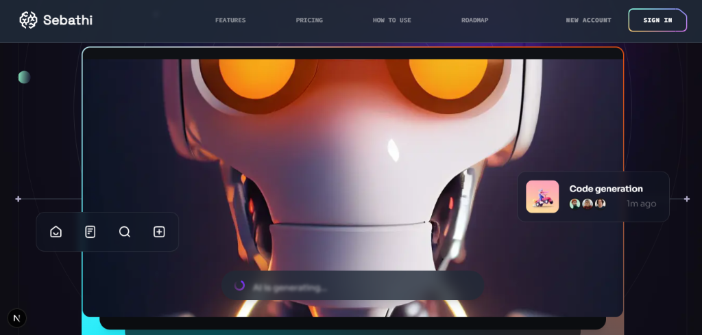

# Sebathi V3 — AI SaaS Platform



> **I hired this project**

🌐 **Live Demo**: [https://sebathi-v3.vercel.app](https://sebathi-v3.vercel.app)

---

**Sebathi V3** is a modern, responsive UI/UX website built for showcasing an AI SaaS platform. It’s developed using Next.js, React, and Tailwind CSS with TypeScript — designed to be scalable, performant, and production-ready.

---

## 📌 Features

- ✔ Built with Next.js + React + Tailwind CSS
- ✔ Type-safe with TypeScript
- ✔ Responsive design for mobile & desktop
- ✔ Easy to customize for your own AI SaaS product
- ✔ Clean folder structure for scalability

---

## 🚀 Live Preview

👉 [https://sebathi-v3.vercel.app](https://sebathi-v3.vercel.app)

See the live deployed version of the project.

---

## 🛠 Tech Stack

| Technology       | Purpose                     |
| ---------------- | --------------------------- |
| **Next.js**      | React framework for SSR/SSG |
| **React**        | UI components               |
| **Tailwind CSS** | Utility-first styling       |
| **TypeScript**   | Static typing               |
| **Vercel**       | Deployment                  |

---

## 📦 Installation

Make sure you have Node.js and Git installed.

1. **Clone repo**
   ```bash
   git clone https://github.com/selvaganapathycoder/Sebathi-V3.git
   cd Sebathi-V3
   ```

2. **Install dependencies**
   ```bash
   npm install
   # or
   pnpm install
   ```

3. **Run locally**
   ```bash
   npm run dev
   ```

4. **Open in browser**
   [http://localhost:3000](http://localhost:3000)

---

## 📁 Project Structure

```
├── app/                   # Next.js App Routes & Layouts
├── components/            # UI Components
├── constants/             # Static data/constants
├── lib/                   # Helper functions
├── public/                # Static assets
├── styles/                # Global styles
├── next.config.ts         # Next.js config
├── tailwind.config.ts     # Tailwind config
├── tsconfig.json          # TypeScript config
```

---

## 💡 Customization

You can adapt this project for your own AI SaaS:

- ✔ Update color theme in `tailwind.config.ts`
- ✔ Replace hero & features content
- ✔ Add authentication (e.g., NextAuth.js)
- ✔ Connect to an AI API (OpenAI, HuggingFace, etc.)

---

## 📄 License

Distributed under the MIT License.
