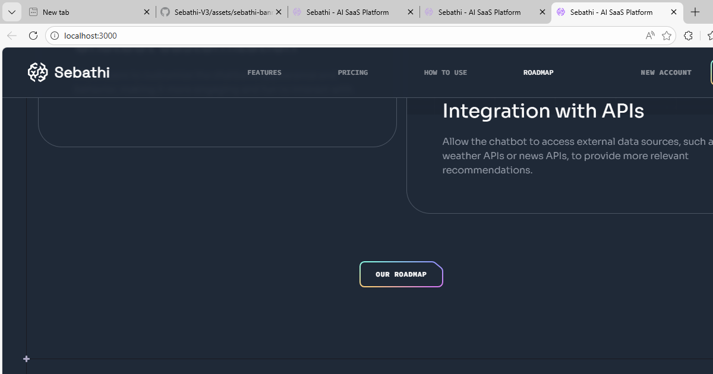

# Sebathi V3 — AI SaaS Platform



> **I hired this project**

<div align="center">

[](https://nextjs.org/)
[](https://react.dev/)
[](https://www.typescriptlang.org/)
[](https://tailwindcss.com/)

[**Live Demo**](https://sebathi-v3.vercel.app) | [**Report Bug**](https://github.com/selvaganapathycoder/Sebathi-V3/issues) | [**Request Feature**](https://github.com/selvaganapathycoder/Sebathi-V3/issues)

</div>

---

## 🚀 Overview

**Sebathi V3** is a high-performance, visually stunning AI SaaS landing page designed to convert. Built with the latest tech stack including **Next.js 15**, **React 19**, and **Tailwind CSS**, it features a modern semantic architecture, smooth parallax effects, and a fully responsive bento-grid layout.

This project demonstrates production-ready code quality, attention to UI/UX details, and scalable component architecture suitable for modern web applications.

---

## 📸 Screenshots


*Modern AI SaaS landing page with stunning gradients, glassmorphism effects, and interactive UI elements*

---

## 💎 Features

- **🎨 Modern UI/UX**: Sleek, dark-themed design with glassmorphism and vibrant gradients.
- **⚡ High Performance**: Optimized for Core Web Vitals using Next.js App Router and Server Components.
- **📱 Fully Responsive**: Flawless experience across all devices, from mobile phones to 4K desktops.
- **🧩 Bento Grid Layout**: Trendy, information-dense layout style for showcasing features effectively.
- **✨ Interactive Elements**: Smooth scroll parallax effects using `react-just-parallax` and micro-interactions.
- **🛠️ Type-Safe**: Built with TypeScript for robust, maintainable, and error-free code.
- **📂 Clean Architecture**: organized folder structure for easy scalability and maintenance.

---

## 🛠 Tech Stack

| Category | Technology | Description |
| :--- | :--- | :--- |
| **Framework** | [Next.js](https://nextjs.org/) | The React Framework for the Web (App Router) |
| **Library** | [React](https://react.dev/) | Server & Client Components |
| **Styling** | [Tailwind CSS](https://tailwindcss.com/) | Utility-first CSS framework |
| **Language** | [TypeScript](https://www.typescriptlang.org/) | Static typing for JavaScript |
| **Animation** | [React Just Parallax](https://www.npmjs.com/package/react-just-parallax) | Mouse and scroll parallax effects |
| **Deployment** | [Vercel](https://vercel.com/) | Zero-config deployment |

---

## 📦 Getting Started

Follow these steps to set up the project locally on your machine.

### Prerequisites

- [Node.js](https://nodejs.org/en/) (v18 or higher)
- [Git](https://git-scm.com/downloads)

### Installation

1. **Clone the repository**
   ```bash
   git clone https://github.com/selvaganapathycoder/Sebathi-V3.git
   cd Sebathi-V3
   ```

2. **Install dependencies**
   ```bash
   npm install
   # or
   pnpm install
   ```

3. **Start the development server**
   ```bash
   npm run dev
   ```

4. **Open the App**
   Visit [http://localhost:3000](http://localhost:3000) in your browser to view the application.

---

## 📁 Project Structure

```bash
├── app/                   # Next.js App Router & Layouts
├── components/            # Reusable UI Components
│   ├── design/            # Design-specific assets (circles, gradients)
│   ├── layout/            # Layout components (Header, Footer)
│   └── sections/          # Page sections (Hero, Features, Pricing)
├── constants/             # Static configuration & data
├── public/                # Static assets (images, icons)
├── lib/                   # Utility functions & helpers
└── styles/                # Global styles & font configuration
```

---

## 👤 Author

**Selvaganapathy**

- GitHub: [@selvaganapathycoder](https://github.com/selvaganapathycoder)
- LinkedIn: [Connect with me](https://www.linkedin.com/)

---

## 📄 License

Distributed under the MIT License. See `LICENSE` for more information.
